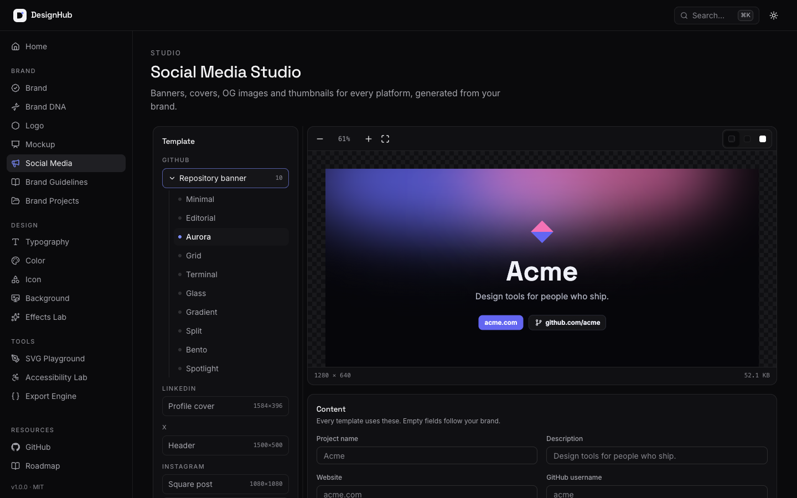

<div align="center">


# DesignHub

**Stop opening 15 design websites. Open one.**

An open-source, local-first design & brand identity toolkit.
Build a brand, then everything it needs: logo variants, mockups, social assets, a brand book and design tokens. Plus typography, color, icons, backgrounds, effects, SVG and accessibility tools, in one fast, keyboard-first workspace.

[Features](#features) · [Screenshots](#screenshots) · [Quick start](#quick-start) · [Roadmap](ROADMAP.md) · [Contributing](CONTRIBUTING.md)

[](https://github.com/yakew7/DesignHub/actions/workflows/ci.yml)


</div>

---

## Why DesignHub?

A typical design session bounces between a font site, a palette generator, a contrast checker, an icon library, a mockup generator, a banner resizer, a brand guidelines template and a tokens converter. DesignHub puts all of it in one tab, driven by one brand, and everything you make stays **on your device**.

- **Open source** - MIT licensed. Fork it, extend it, self-host it.
- **One source of truth** - change a color or font once and every logo variant, mockup, social asset, guideline page and token file updates.
- **Local first** - brands, projects, palettes and settings persist in IndexedDB.
- **No login, no backend** - there is no server to send your work to.
- **Offline first** - color, type scale and export tools work without a connection; icons you have opened are cached for offline use.
- **Keyboard first** - `⌘K` for everything, `G` + letter to jump, `Space` to shuffle.
- **Production ready** - exports drop straight into CSS, SCSS, Tailwind (v3 and v4), React and Vue, plus PNG, PDF and ZIP asset packs.
- **Dark & light** - tuned themes that follow your system preference.

## Features

| Studio                | What it does                                                       | Exports                                                     |
| --------------------- | ------------------------------------------------------------------ | ----------------------------------------------------------- |
| **Brand Studio**      | Name, logo, colors with roles, type, radius, spacing, shadow       | Brand JSON · design tokens                                  |
| **Brand DNA** (beta)  | Palette, mood, type and personality from any image, on-device      | Applies to the brand                                        |
| **Logo Studio**       | SVG editor, construction grid, clear space, seven variants         | SVG · PNG · PDF · logo pack ZIP                             |
| **Mockup Studio**     | Stationery, poster, laptop, desktop and mobile mockups             | PNG (up to 4×) · PDF                                        |
| **Social Media**      | GitHub, LinkedIn, X, Instagram, OG, Product Hunt, YouTube          | PNG (1× / 2×) · OG meta tags · social ZIP                   |
| **Brand Guidelines**  | A 14-page brand book generated from the brand                      | PDF · PNG per page                                          |
| **Brand Projects**    | Several local brands, autosaved, favorites, duplicate              | Project JSON (one or all)                                   |
| **Typography Studio** | Google Fonts, variable axes, pairing, fluid type scale, OpenType   | CSS · Tailwind · SCSS · React · JSON tokens                 |
| **Color Studio**      | Palettes, harmonies, OKLCH, shades 50–950, gradients, WCAG         | CSS variables · Tailwind · JSON tokens · SVG gradient       |
| **Icon Studio**       | 200,000+ Iconify icons, restyling, favicons                        | SVG · React · CSS · PNG · ICO · favicon ZIP                 |
| **Background Studio** | 16 generators: waves, mesh, aurora, low poly, bokeh, sunburst…     | SVG · PNG (1× / 2×) · CSS background                        |
| **Effects Lab**       | Glass, neumorphism, layered shadows, glow, gradient borders, grain | CSS · Tailwind classes · Tailwind `@utility` · SCSS · React |
| **SVG Playground**    | Inspect, edit, optimize, convert, build sprites                    | Optimized SVG · JSX · React · React Native · sprite         |
| **Accessibility Lab** | WCAG contrast, color vision, readability, dyslexia, touch targets  | JSON audit report                                           |
| **Export Engine**     | One token model from every studio, plus brand assets               | CSS · SCSS · Less · Tailwind · React · Vue · Android · JSON |

### Brand Studio

- The hub of your identity: name, description, logo (upload an SVG or use the generated mark), colors with primary / secondary / neutral roles, heading and body fonts, radius, spacing and shadow
- Synchronized tokens: the brand store keeps only what is unique to the brand and reads everything else live from Color Studio, Typography Studio, the Export Engine and the Effects Lab, so there is never a second copy
- Live preview in light and dark with a UI kit, and a token panel with every format from the Export Engine

### Brand DNA (beta)

- Upload a logo, product shot or moodboard; get a weighted palette, a mood, a type pairing, a radius and personality words
- Provider architecture: an **on-device** provider (free, private, instant) and an **AI (mock)** provider that returns sample data, both behind one `BrandDnaProvider` interface in `lib/brand-dna`
- Staged loading states, editable results and one-click **Apply to brand** with undo

### Logo Studio

- SVG logo editor: recolor every color, monochrome and inverted modes
- **Construction grid, clear space and safe area** guides
- Responsive variants: full color, monochrome, inverted, horizontal and stacked lockups, wordmark and app icon, with a minimum-size strip and background tests
- **Logo pack**: every variant as SVG, PNG and PDF in one ZIP with usage notes

### Mockup Studio

- Print: **business card, letterhead, envelope, stickers, poster**
- Screens: **landing page on a laptop, analytics dashboard on a desktop, three-screen mobile app**
- Drawn as SVG from the live brand, in light or dark, with your fonts embedded so exports match the preview
- High-resolution **PNG (1-4×) and PDF**

### Social Media Studio

- **GitHub repository banner in 15 styles**: Minimal, Editorial, Aurora, Grid, Terminal, Glass, Gradient, Split, Bento, Spotlight, Classic, Launch, Showcase, Features and Badges
- **LinkedIn** cover, **X** header, **Instagram** square post and story, **Open Graph** (article, product, minimal), **Product Hunt** gallery and **YouTube** thumbnail
- Exact platform sizes, a safe-area overlay and the zones covered by avatars and timestamps
- One content panel drives every template: project name, description, website, GitHub username, logo, primary and secondary colors, background style, border radius and padding (empty fields follow the brand)
- Export PNG, @1x or @2x, SVG, copy the image to the clipboard, Open Graph meta tags, and **all assets as a ZIP**
- GitHub banners come with a **README snippet** to paste, with an optional "Banner made with DesignHub" link under the image (never on it)

### Brand Guidelines

- A complete brand book: **cover, introduction, logo usage, clear space, minimum size, incorrect usage, color palette, typography, iconography, UI components, accessibility, voice & tone and a design token appendix**
- Pages can be switched off; numbering and contents follow. Voice and tone are edited in place
- **Export the book as a PDF** (pdf-lib) or any page as PNG

### Brand Projects

- Keep several brands side by side in IndexedDB; each project is a snapshot of every brand-defining studio
- Create, open, rename, duplicate, delete and favorite; last edited and last opened; search and a favorites filter
- The open project **autosaves** while you work anywhere in the app
- **Import and export JSON**, one project or all of them, validated and sanitized on import

### Typography Studio

- Google Fonts browser with 1,000 families, lazy-loaded previews that download only the glyphs they show
- Search, category filters, variable-only filter, sort by popularity / name / weight count
- Favorites and recent fonts
- Variable font playground: a slider for every axis (`wght`, `wdth`, `opsz`, `SOFT`, `WONK`, …) plus axis animation
- Weight and italic controls, letter spacing and line height
- Font pairing engine: 42 curated pairs, rule-based suggestions, random pairing with locks, saved pairs
- Fluid type scale generator (separate mobile and desktop ratios) and a standalone `clamp()` generator
- Responsive preview at any viewport width
- OpenType controls: ligatures, small caps, lining / oldstyle / tabular figures, fractions, slashed zero, stylistic sets
- Local font inspector powered by OpenType.js (your file never leaves the browser)
- Exports: **CSS, Tailwind, SCSS, React, JSON tokens** and a Google Fonts embed

### Color Studio

- Palette generator with locked colors, undo / redo and saved palettes
- Palette library: 48 curated palettes filterable by mood (SaaS, corporate, pastel, playful, neon, retro, earthy, forest, ocean, sunset, luxury, monochrome)
- Harmony modes: analogous, complementary, split-complementary, triadic, tetradic, monochromatic
- OKLCH editor with live gradient sliders and **HEX / RGB / HSL / OKLCH** inputs (accepts any CSS color)
- sRGB and Display P3 gamut indicators
- Shade generator (**50–950**) computed in OKLCH, with hue shift
- Gradient builder: **linear, radial and conic**, draggable stops, OKLCH / OKLab / sRGB interpolation
- **WCAG** contrast checker with AA / AAA results, one-click fixes and a full palette contrast matrix
- Color blindness preview (protanopia, deuteranopia, tritanopia, achromatopsia)
- Exports: **CSS variables, Tailwind, JSON tokens, SVG gradient**

### Icon Studio

- Search 200,000+ open-source icons from 200+ Iconify collections
- Browse by collection, with license information
- Browse by topic before you search: 10 curated packs of 24 icons (UI essentials, arrows, brands, developer, design, commerce, communication, media, files, weather), plus one-click search suggestions
- Restyle: color, stroke width, rounded or sharp corners, rotate, flip, padding and background shapes
- Exports: **SVG, React (TSX), CSS data URI, PNG (16–1024 px) and ICO**
- Favicon generator: `favicon.ico`, `icon.svg`, Apple touch icon, PWA icons, `site.webmanifest` and HTML - zipped

### Export Engine

- One shared design-token model built live from every studio
- Generates **CSS variables, SCSS, Less, Tailwind v4 `@theme`, Tailwind v3 config, React theme, Vue theme, Android `colors.xml` and JSON tokens** (W3C DTCG format)
- Semantic roles (primary, accent, foreground, background) inferred from your palette
- 8px spacing scale and 12px radius scale, both configurable
- Live preview UI kit, one-click copy, **Download JSON**, all formats as `.zip`, preview PNG and a PDF style guide
- Effect tokens (`--shadow-card`, `--shadow-glow`, `--blur-glass`) that follow Tailwind v4's theme namespaces
- **Brand assets**: Brand JSON, the brand guidelines PDF, the logo pack ZIP and the social asset ZIP, built on demand
- **Assets**: background CSS + SVG, the full `effects.css` bundle, the optimized SVG and the accessibility report - always in sync with their studios

### Background Studio

- Sixteen procedural generators: **waves, blobs, mesh gradients, aurora, noise texture, dots, grid, isometric, rings, checks, low poly, bokeh, confetti, chevron, hexagons and sunburst**
- Seeded and deterministic - every seed reproduces exactly; **Randomize** (or `Space`) rolls a new one
- Shared controls for colors (or one click to use your Color Studio palette), density, scale, rotation and canvas size (desktop, Full HD, Open Graph, square, story)
- Blobs are smoothed with **Paper.js** (loaded on demand); noise uses SVG `feTurbulence`
- Rotation always covers the canvas edge to edge
- Exports: **SVG, PNG (1× and 2×) and CSS** - native CSS gradients for mesh, dots and grid; an inline SVG data URI for the rest

### Effects Lab

- **Glassmorphism** - blur, saturation, tint, opacity, border and shadow
- **Neumorphism** - depth, softness, intensity, light direction, radius; flat, concave, convex and pressed shapes
- **Shadow generator** - unlimited layers (x, y, blur, spread, color, opacity, inset) plus 15 presets: subtle, smooth, elevated, sharp, inner, hairline, soft card, material, floating, dramatic, brutal, long drop, colored glow, pressed and focus ring
- **Glow generator** - color, radius and intensity with optional text glow
- **Border generator** - gradient borders with no extra markup, and animated conic borders via `@property` (respects reduced motion)
- **Grain overlay** - fractal-noise texture with scale, frequency, opacity and blend mode
- Live preview on gradient, photo, light or dark backdrops
- Exports: **CSS, Tailwind arbitrary-property classes, Tailwind v4 `@utility`, SCSS mixins and React style objects**

### SVG Playground

- Upload, **drag & drop** or paste SVG; edit the source live
- Safe preview (rendered as an image, so embedded scripts never run) with zoom, fit and backdrops
- **viewBox editor** and intrinsic size controls, including "make responsive"
- **Path & group inspector**: keyboard-navigable element tree, selection highlight, path command breakdown (via svg-path-parser), bounds
- **Fill & stroke editor** for the selected element or every shape at once
- **Optimization engine** (built on svgson): metadata and editor-data removal, id cleanup, group collapsing, precision control, shortest absolute/relative path data, color shortening, style-to-attribute conversion - scripts and event handlers are always stripped
- **Minify** or **pretty print**, with byte savings
- Converters: **SVG → JSX, SVG → React component (TypeScript), SVG → React Native** (react-native-svg)
- **Sprite generator**: combine many SVGs into one `<symbol>` sprite with namespaced ids and usage snippets
- **Download optimized SVG**

### Accessibility Lab

- **WCAG checker** - body text, links, button labels and non-text UI (1.4.11) with AA / AAA verdicts and one-click fixes
- **Vision simulation** - protanopia, deuteranopia, tritanopia, grayscale and low vision, one at a time or side by side, plus _perceived_ contrast under each
- **Readability** - font size validator, line-height analysis (WCAG 1.4.12), characters-per-line measured in the real font, Flesch reading score and grade
- **Dyslexia preview** - letter and word spacing, a dyslexia-friendly preset and a letter-scrambling reading simulation
- **Touch targets** - 44px validator (2.5.5 AAA) and the 24px + spacing check (2.5.8 AA), drawn to scale
- Everything updates instantly and exports as a **JSON report**

## Screenshots

| Brand Studio                                | Mockup Studio                                  |
| ------------------------------------------- | ---------------------------------------------- |
|  |  |

| Social Media Studio                                 | Brand Guidelines                                     |
| --------------------------------------------------- | ---------------------------------------------------- |
|  |  |

| Home                               | Typography                                            |
| ---------------------------------- | ----------------------------------------------------- |
|  |  |

| Colors                                       | Contrast (light theme)                                 |
| -------------------------------------------- | ------------------------------------------------------ |
|  |  |

| Icons                                      | Export Engine                                 |
| ------------------------------------------ | --------------------------------------------- |
|  |  |

## Quick start

Requirements: **Node.js 22+** and **pnpm 11** (the version is pinned in `package.json`; run `corepack enable` to get it automatically). No API keys are needed.

```bash
git clone https://github.com/yakew7/DesignHub.git
cd DesignHub
pnpm install
pnpm dev
```

Open [http://localhost:3000](http://localhost:3000).

### Environment variables

None are required. To set the public URL used for canonical links, the sitemap and social previews, copy the example file:

```bash
cp .env.example .env.local
```

| Variable               | Required | Default                 | Purpose                                     |
| ---------------------- | -------- | ----------------------- | ------------------------------------------- |
| `NEXT_PUBLIC_SITE_URL` | No       | `https://designhub.dev` | Canonical URL, sitemap, robots and OG links |

### Scripts

| Command              | Description                                 |
| -------------------- | ------------------------------------------- |
| `pnpm dev`           | Start the development server                |
| `pnpm build`         | Create a production build                   |
| `pnpm start`         | Serve the production build                  |
| `pnpm lint`          | Run ESLint                                  |
| `pnpm typecheck`     | Run the TypeScript compiler in strict mode  |
| `pnpm format`        | Format with Prettier                        |
| `pnpm format:check`  | Check formatting (used in CI)               |
| `pnpm fonts:catalog` | Regenerate the bundled Google Fonts catalog |
| `pnpm check:dashes`  | Fail if any file contains an em dash        |

DesignHub builds to fully static pages, so you can deploy it to any static or Node host (Vercel, Netlify, Cloudflare Pages, a VPS).

### Continuous integration

GitHub Actions run on every push and pull request with Node 22 and pnpm: `ci.yml` (install, typecheck, lint, format check, build), `lint.yml` and `typecheck.yml`. Publishing a GitHub Release runs `release.yml`, which builds the app and attaches the build as an artifact. `em-dash.yml` fails if an em dash appears anywhere in the repository (the project uses normal hyphens and punctuation). `welcome.yml` greets first-time contributors on their first issue or pull request.

## Keyboard shortcuts

| Keys                   | Action                                                                                                                                                                                                                           |
| ---------------------- | -------------------------------------------------------------------------------------------------------------------------------------------------------------------------------------------------------------------------------- |
| `⌘K` / `Ctrl K` or `/` | Command palette                                                                                                                                                                                                                  |
| `?`                    | Show all shortcuts                                                                                                                                                                                                               |
| `⌥T`                   | Toggle dark / light theme                                                                                                                                                                                                        |
| `G` then a letter      | Go to a studio: `H` Home, `R` Brand, `D` Brand DNA, `L` Logo, `M` Mockups, `O` Social, `U` Guidelines, `P` Projects, `T` Typography, `C` Colors, `I` Icons, `B` Backgrounds, `F` Effects, `S` SVG, `A` Accessibility, `E` Export |
| `F`                    | Focus search (Typography, Icons)                                                                                                                                                                                                 |
| `Space`                | Generate palette (Colors) · random pair (Typography › Pairing)                                                                                                                                                                   |
| `Z` / `⇧Z`             | Undo / redo palette changes                                                                                                                                                                                                      |
| `R` / `⇧R`             | Rotate icon                                                                                                                                                                                                                      |
| `[` / `]`              | Previous / next template (Mockups, Social)                                                                                                                                                                                       |

## Tech stack

| Area          | Choice                                                                                                                                           |
| ------------- | ------------------------------------------------------------------------------------------------------------------------------------------------ |
| Framework     | [Next.js 16](https://nextjs.org) (App Router, static rendering)                                                                                  |
| Language      | TypeScript (strict, no `any`)                                                                                                                    |
| Styling       | [Tailwind CSS v4](https://tailwindcss.com)                                                                                                       |
| UI primitives | [shadcn/ui](https://ui.shadcn.com) on [Radix](https://www.radix-ui.com), [cmdk](https://cmdk.paco.me), [Sonner](https://sonner.emilkowal.ski)    |
| Animation     | [Framer Motion](https://motion.dev)                                                                                                              |
| State         | [Zustand](https://zustand.docs.pmnd.rs)                                                                                                          |
| Storage       | [Dexie](https://dexie.org) (IndexedDB)                                                                                                           |
| Color         | [Color.js](https://colorjs.io)                                                                                                                   |
| Fonts         | Google Fonts + [OpenType.js](https://opentype.js.org)                                                                                            |
| Icons         | [Iconify](https://iconify.design)                                                                                                                |
| SVG           | [svgson](https://github.com/elrumordelaluz/svgson), [svg-path-parser](https://github.com/hughsk/svg-path-parser), [Paper.js](http://paperjs.org) |
| Export        | [html-to-image](https://github.com/bubkoo/html-to-image), [pdf-lib](https://pdf-lib.js.org)                                                      |

## Folder structure

```
DesignHub/
├── app/                    # Routes: (marketing) home, (studio) brand · brand-dna · logo · mockups · social ·
│                           #         guidelines · projects · typography · colors · icons · backgrounds ·
│                           #         effects · svg · accessibility · export
├── components/
│   ├── ui/                 # Design-system primitives (shadcn/ui based)
│   ├── layout/             # App shell, navigation, command palette, providers
│   ├── home/               # Landing page sections
│   ├── brand/              # Brand Studio settings, preview and UI kit
│   ├── brand-dna/          # Brand DNA upload, providers and result editor
│   ├── logo/               # Logo Studio editor, guides, variants and export
│   ├── mockups/            # Mockup Studio
│   ├── social/             # Social Media Studio
│   ├── guidelines/         # Brand Guidelines
│   ├── projects/           # Brand Projects and autosave
│   ├── typography/         # Typography Studio
│   ├── colors/             # Color Studio
│   ├── icons/              # Icon Studio
│   ├── backgrounds/        # Background Studio
│   ├── effects/            # Effects Lab
│   ├── svg/                # SVG Playground
│   ├── accessibility/      # Accessibility Lab
│   ├── canvas/             # Reusable SVG preview canvas
│   └── export/             # Export Engine and shared export UI
├── hooks/                  # Reusable React hooks (hotkeys, catalog, icon data, tokens…)
├── lib/
│   ├── brand/              # Brand tokens, surfaces, generated logo mark, font embedding, Brand JSON
│   ├── brand-dna/          # Provider interface, on-device and mock providers, palette extraction
│   ├── logo/               # Recolor, guides, variants, logo pack
│   ├── mockups/            # SVG drawing kit and mockup templates
│   ├── social/             # Social templates, safe areas, social pack
│   ├── guidelines/         # Brand book pages and PDF builder
│   ├── projects/           # Snapshots, Dexie repository, import / export
│   ├── export/             # Rasterizer and image-to-PDF
│   ├── color/              # OKLCH math, harmonies, shades, gradients, contrast, vision
│   ├── typography/         # Font catalog, Google Fonts URLs, scales, pairing, exports
│   ├── icons/              # Iconify client, SVG builder, ICO / favicon generation
│   ├── background/         # Seeded PRNG, generators, SVG/CSS background export
│   ├── effects/            # Effect definitions and CSS / Tailwind / SCSS / React writers
│   ├── svg/                # Parser, serializer, optimizer, inspector, JSX / React Native, sprites
│   ├── a11y/               # Contrast pairs, vision, readability and touch-target checks
│   ├── tokens/             # Shared design-token model and format generators
│   ├── db.ts               # Dexie database + Zustand storage adapter
│   └── zip.ts              # Tiny dependency-free ZIP writer
├── store/                  # Zustand stores (persisted to IndexedDB)
├── types/                  # Shared TypeScript types
├── scripts/                # Maintenance scripts (font catalog generator)
├── public/
└── docs/                   # Architecture notes and screenshots
```

Read [docs/architecture.md](docs/architecture.md) for how the pieces fit together and [docs/design-tokens.md](docs/design-tokens.md) for the token format.

## Privacy

DesignHub has no accounts and no backend. Your work (brands, projects, palettes, settings) is stored in your browser's IndexedDB and never leaves your device. The app makes network requests to:

- `fonts.googleapis.com` / `fonts.gstatic.com` - to preview Google Fonts and embed brand fonts in exports
- `api.iconify.design` (with `api.simplesvg.com` and `api.unisvg.com` as fallbacks) - to search and download icons
- [Vercel Web Analytics](https://vercel.com/docs/analytics/privacy-policy) - on the hosted site only, to count page views

Vercel Web Analytics is cookie-free and anonymous. It records which pages are visited, the referrer, and the visitor's country, browser, OS and device type, without identifying individuals or tracking them across sites. It never sees what you create in the app. It only loads in builds deployed on Vercel, so self-hosted copies and local development send nothing. To remove it from your own deployment, delete `<Analytics />` from `app/layout.tsx`.

Exported PNGs, PDFs and generated SVGs carry a small "Made with DesignHub" note in their file metadata (not on the artwork), and the README inside each ZIP credits the project. Your own uploaded logos are never modified.

Uploaded logos and Brand DNA images are processed in the browser and never uploaded. None of these services needs an API key.

## Roadmap

- **V1** - Typography, Colors, Icons, Export ✅
- **V2** - Background Studio, Effects Lab, Accessibility Lab, SVG Playground ✅
- **V3** - Brand Studio, Logo Studio, Mockups, Social Media, Brand Guidelines, Brand Projects, Brand DNA ✅
- **Next** - Plugin marketplace, desktop app, AI Brand DNA, team collaboration

See [ROADMAP.md](ROADMAP.md) for details.

## Contributing

Contributions of all sizes are welcome - bug reports, docs, new export formats or a whole new studio. Start with [CONTRIBUTING.md](CONTRIBUTING.md), and please follow our [Code of Conduct](CODE_OF_CONDUCT.md). Security issues: see [SECURITY.md](SECURITY.md).

## License

[MIT](LICENSE) © DesignHub contributors.

Fonts are served by Google Fonts under their respective open licenses. Icons are provided by Iconify; each collection keeps its own license, which is shown in the Icon Studio.
